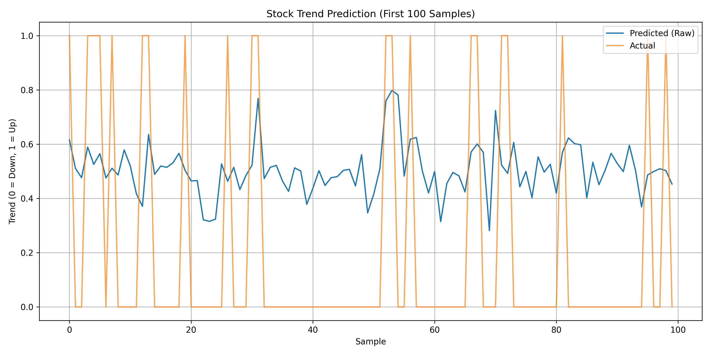

# Stock Trend Prediction using LSTM and Sentiment

This project predicts the short-term trend of a stock using LSTM neural networks trained on:
- Historical price data
- News sentiment
- Technical indicators (SMA, RSI, MACD, etc.)

### 🛠️ Technologies
- PyTorch
- yFinance
- ta (technical indicators)
- VADER Sentiment (preprocessed)

### 📈 Output

### 📦 How to Run

1. Clone the repo
2. Install requirements
